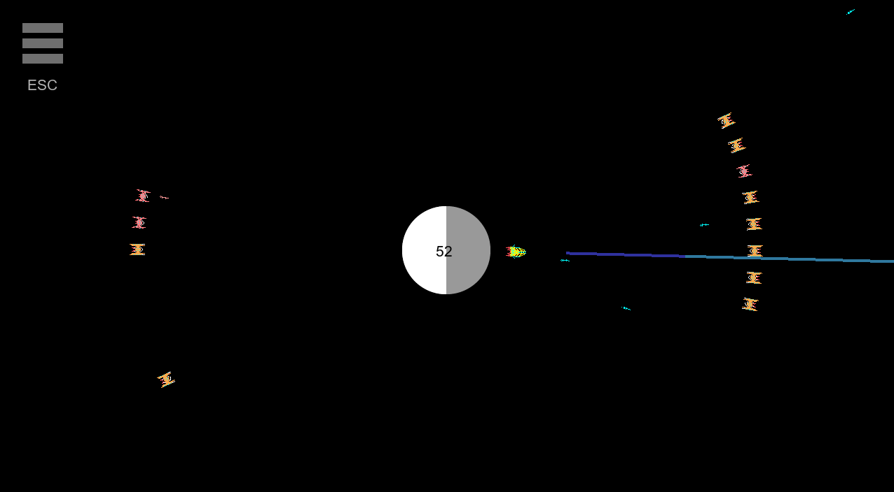

# PlanetInvaders

Game based off Space Invaders, but with rotational motion.

Made in GameMaker Studio 2.

## Installation (Windows)

1. [Download PlanetInvaders.zip](https://github.com/Cresspresso/PlanetInvaders/releases/download/1.0/PlanetInvaders.zip)
2. Unzip (e.g. by using [7-Zip](https://www.7-zip.org/download.html))
3. Run PlanetInvaders.exe

---

. | .
--- | ---
Version | 1.0
Author | Elijah Shadbolt
Date | 07/05/2018

Bachelor of Software Engineering

Media Design School

Auckland

New Zealand

(c) 2018 Media Design School
